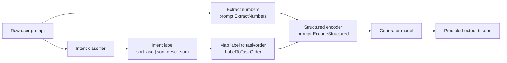
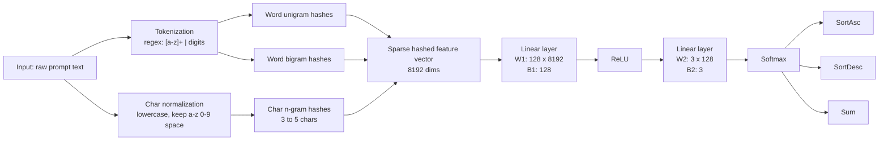

```mermaid
flowchart LR
    A["Input: structured token sequence<br/>length = 10"] --> B["Embedding lookup<br/>vocab = 16<br/>dim = modelDim"]
    B --> C["Add sinusoidal positional encoding"]
    C --> D["Multi-head attention"]

    D --> D1["Per head projections<br/>WQ, WK, WV: modelDim -> headDim"]
    D1 --> D2["Scaled attention per head"]
    D2 --> D3["Concat heads + WO"]

    D3 --> E["Residual add + norm"]
    E --> F["Feed-forward network"]
    F --> F1["W1: modelDim -> 4 * modelDim"]
    F1 --> F2["W2: 4 * modelDim -> modelDim"]

    F2 --> G["Output projection<br/>modelDim -> vocabSize"]
    G --> H["Logits per position"]
    H --> I["Argmax choices"]
```

# Attention Learning Project

This repository is a small end-to-end learning project for building and training two custom models in Go:

- An `intent` classifier that maps a natural-language prompt to one of three labels: `sort_asc`, `sort_desc`, or `sum`
- An `embed` generator that consumes a structured token sequence and predicts the target output tokens

The project is intentionally small and explicit. The models, training loop, dataset generation, checkpointing, and inference path are all implemented locally in this repository.

## What The System Does

Given a prompt such as:

```text
sort list [3, 4, 2, 5, 1] desc
```

the runtime pipeline does this:

1. Extract the numbers from the prompt.
2. Run the prompt through the intent classifier.
3. Convert the predicted intent into a structured task and order.
4. Encode the task and numbers into a fixed token sequence.
5. Run that sequence through the generator model.
6. Read the predicted output tokens as the final answer.

## End-To-End Architecture



The main inference entrypoint is implemented in `cmd/predict/main.go`.

## Model Architectures

### Intent Classifier

The intent model is defined in `internal/intent/model.go`.

It is a small multilayer perceptron over hashed text features:

- Input: raw prompt text
- Features:
  - word unigrams
  - word bigrams
  - character n-grams of length 3 through 5
- Feature space: 8192 hashed dimensions
- Hidden layer: 128 units with ReLU
- Output classes: 3

Architecture:



Compact form:

```text
text -> hashed sparse features (8192) -> Linear(8192, 128) -> ReLU -> Linear(128, 3) -> Softmax
```

### Generator Model

The generator is defined in `internal/attention/model.go` and uses a transformer block from `internal/transformer/transformer_block.go`.

At inference time it receives a fixed-length structured token sequence produced by `internal/prompt/prompt.go`.

Default shape:

- Vocabulary size: 16
- Sequence length: 10
- Model dimension: 64
- Attention heads: 4

Architecture:



Compact form:

```text
tokens(10) -> Embedding(16, 64) -> Positional Encoding -> MHA(4 heads) -> Add&Norm -> FFN(64 -> 256 -> 64) -> Output(64 -> 16)
```

## Structured Token Encoding

The generator does not operate directly on raw text. Instead, prompts are encoded into a compact symbolic sequence in `internal/prompt/prompt.go`.

Vocabulary:

- Digits `0-9`
- `sort`
- `list`
- `asc`
- `desc`
- `sum`
- `pad`

Constants:

- `MinListLen = 3`
- `MaxListLen = 7`
- `SequenceLen = 10`
- `VocabSize = 16`

Example sort encoding:

```text
[sort, list, 3, 4, 2, 5, 1, pad, pad, desc]
```

Example sum encoding:

```text
[sum, list, 3, 4, 2, 5, 1, pad, pad, pad]
```

## Datasets

Datasets are generated by `cmd/gen`.

Supported modes:

- `ops`: training data for the generator model
- `intent`: training data for the intent classifier
- `ood`: out-of-distribution intent-style prompts for robustness evaluation and inspection

The binary record format is defined in `internal/output/output.go`:

- prompt text
- target text
- intent label

Generate datasets:

```bash
go run ./cmd/gen ops 50000
go run ./cmd/gen intent 50000
go run ./cmd/gen ood 10000
```

Generated files are written under `./dataset/`.

## Training

There are two independent training entrypoints:

- `cmd/intent` trains the intent classifier
- `cmd/embed` trains the generator

### Train The Intent Model

```bash
go run ./cmd/intent ./dataset/intent_train_<timestamp>.bin
```

This saves the checkpoint to:

```text
./checkpoints/intent_model.bin
```

### Train The Generator Model

```bash
go run ./cmd/embed ./dataset/<timestamp>.bin
```

This saves the checkpoint to:

```text
./checkpoints/embed_model.bin
```

Default training settings from `internal/trainer/trainer.go`:

- Epochs: `3`
- Learning rate: `0.01`
- Batch size: `256`
- Model dimension: `64`
- Attention heads: `4`

Environment overrides:

- `ATTN_BATCH_SIZE`
- `ATTN_GRAD_WORKERS`
- `ATTN_MODEL_DIM`
- `ATTN_NUM_HEADS`

## Inference

Use `cmd/predict` to run the full pipeline:

```bash
go run ./cmd/predict "sort list [3, 4, 2, 5, 1] desc"
go run ./cmd/predict "sum the list [3, 4, 2, 5, 1]"
```

The command:

1. loads `./checkpoints/intent_model.bin`
2. predicts the intent
3. encodes the prompt into structured tokens
4. loads `./checkpoints/embed_model.bin`
5. runs the generator forward pass
6. prints the predicted output

## Inspecting Datasets

Use `cmd/decode` to inspect generated binary data:

```bash
go run ./cmd/decode ./dataset/<file>.bin 5
```

This prints the first `N` decoded records, including prompt, target, and intent label.

## Repository Layout

```text
cmd/
  decode/   Inspect dataset files
  embed/    Train the generator model
  gen/      Generate training datasets
  intent/   Train the intent classifier
  predict/  Run end-to-end inference

internal/
  attention/    Generator model and packed inference helpers
  checkpoint/   Checkpoint save/load
  embbeding/    Embedding table implementation
  intent/       Intent classifier
  loss/         Cross-entropy helpers
  matrix/       Matrix ops and packed kernels
  output/       Dataset record format
  progress/     CLI progress reporting
  prompt/       Prompt parsing and structured token encoding
  trainer/      Training loops for both models
  transformer/  Transformer block, attention, FFN, positional ops

pkg/
  decode/       Dataset decoding helpers
```

## Notes

- This repository is a learning project, not a general-purpose language model.
- The system is intentionally narrow: it learns sorting and summation over short lists of digits.
- The architecture is small enough to inspect end-to-end, which makes it useful for experimenting with attention, tokenization, training loops, and checkpointing without hiding the core mechanics behind a framework.
