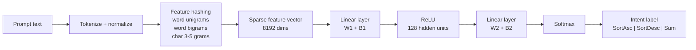
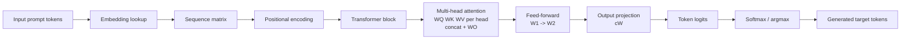
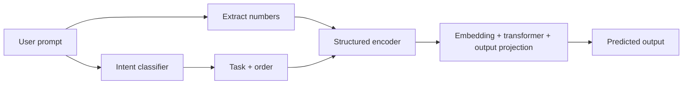

# Attention paper learning project

## Tasks

- Data Generator: (/gen/cmd/gen) Create thousands of random short lists of integers
- Embedding Layer: Map each integer to a 32 or 64-dimensional vector
- Positional Encoding: Implement the sin and cos formulas to give those numbers a "place" in the list.
- Single-Head attention: Start with one "head" to see the raw math before moving to "Multi-Head".

## Architecture

### Intent Model

The intent classifier is a small hashed-feature MLP defined in `internal/intent/model.go`.

### Embed / Generator Model

The generator path uses an embedding layer, one transformer block, and an output projection.

### Overall Architecture

Today the project uses two separate learned components:

- `intent`: a lightweight classifier that routes prompts into `sort asc`, `sort desc`, or `sum`
- `embed`: the sequence model that produces the target output text
